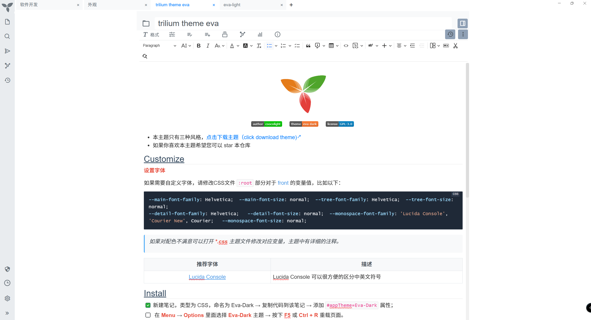
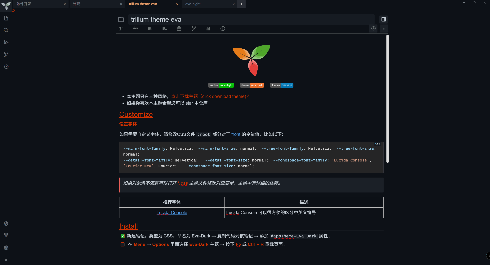

# Trilium Eva Dark Theme

## 介绍
Trilium eva Dark Theme 是一个 trilium 主题，提供了更好看、更简约的界面。
在 Vs Code 中, 我比较喜欢的主题是[Eva Theme](https://github.com/fisheva/Eva-Theme), 所以在使用 Trilium 后, 我花了点时间写了这个主题，希望能够提供更沉浸的体验。

本项目提供三个主题

+ **深色主题**：eva-dark、eva-night
+ **浅色主题**：eva-light

## 预览

### eva-light

### eva-dark

### eva-night

## 安装步骤

按照以下步骤安装：

1. 创建一个新笔记，类型为 **CSS**，例如：命名为 **Eva-Dark** ；
2. 然后复制对应主题的内容到刚才创建的笔记；
3. 添加 `#appTheme=主题名称` 属性，例如 **Eva-Dark**；
4. 在 **Menu** →  **Options** 里面选择刚才定义 **Eva-Dark** 主题；
5. 按下 **F5** 或 **Ctrl + R** 重载页面。

## 已知问题

- [ ] 同步消息弹窗关闭符号太暗，且居中，右侧大片空白；

  

## 参考项目

+ [trilium-vscode-dark-theme](https://github.com/greengeek/trilium-vscode-dark-theme)
+ [Allure](https://github.com/JadeVane/Allure/tree/main)
+ [awesome-trilium](https://github.com/Nriver/awesome-trilium/tree/main)
+ [Eva Theme](https://github.com/fisheva/Eva-Theme)

