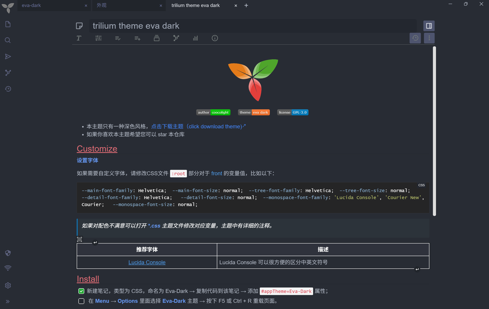

# Trilium Eva Dark Theme

## 介绍
Trilium eva Dark Theme 是一个 trilium 主题，提供了更好看、更简约的界面。
在 Vs Code 中, 我比较喜欢的主题是[Eva Theme](https://github.com/fisheva/Eva-Theme), 所以在使用 Trilium 后, 我花了点时间写了这个主题，希望能够提供更沉浸的体验。

## 预览

## 安装步骤

按照以下步骤安装：

1. 创建一个新笔记，类型为 CSS，命名为 Eva-Dark 
2. 然后复制主题的内容到刚才创建的笔记
3. 添加 `#appTheme=Eva-Dark` 属性
4. 在 **Menu** →  **Options** 里面选择 **Eva-Dark** 主题
5. 按下 F5 或 Ctrl + R 重载页面

## 已知问题

- [ ] 同步消息弹窗关闭符号太暗，且居中，右侧大片空白；

  

## 参考项目

+ [trilium-vscode-dark-theme](https://github.com/greengeek/trilium-vscode-dark-theme)
+ [Allure](https://github.com/JadeVane/Allure/tree/main)
+ [awesome-trilium](https://github.com/Nriver/awesome-trilium/tree/main)
+ [Eva Theme](https://github.com/fisheva/Eva-Theme)

